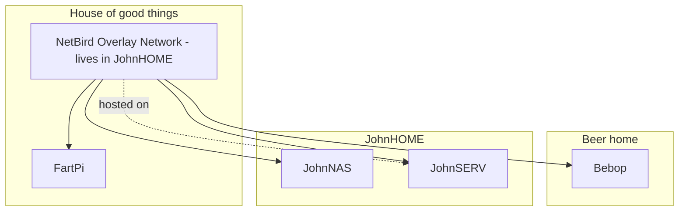
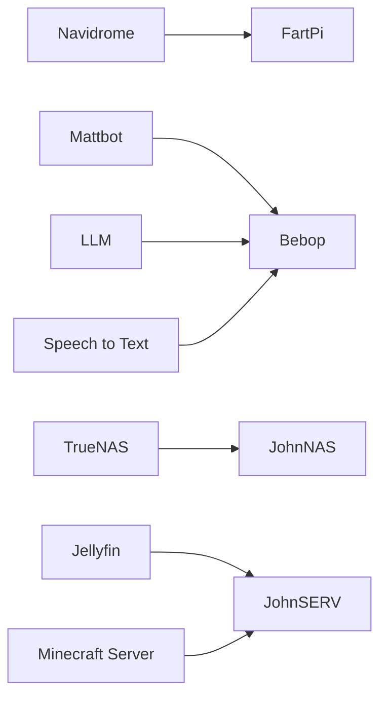
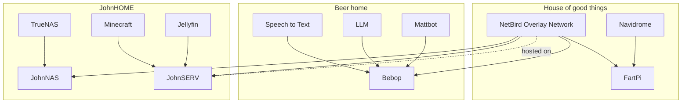

# Homelab

Overview of machines and services in the lab.

---

# Topology



---

# NetBird Access

All host-to-host connectivity in this lab is expected to run over NetBird.

1. Install NetBird on your client and sign in to the same NetBird network.
2. Verify your peer is connected in the NetBird dashboard.
3. Connect to services using each node's NetBird IP or DNS name.

Example:

```bash
ssh user@<netbird-hostname-or-ip>
```

---

# Sites

## JohnSERV

| Site | Server | URL |
| --- | --- | --- |
| Jellyfin | JohnSERV | http://100.124.56.240:8096/ |

---

# Services



---

# Full View

